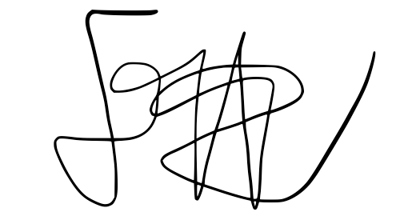
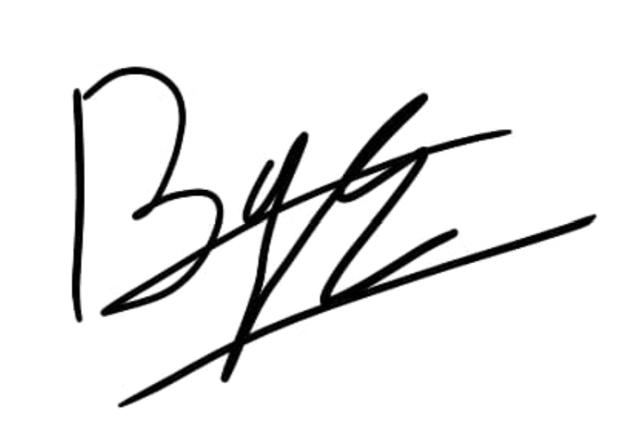
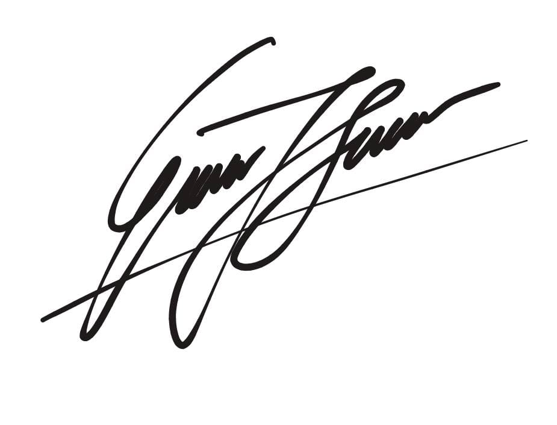
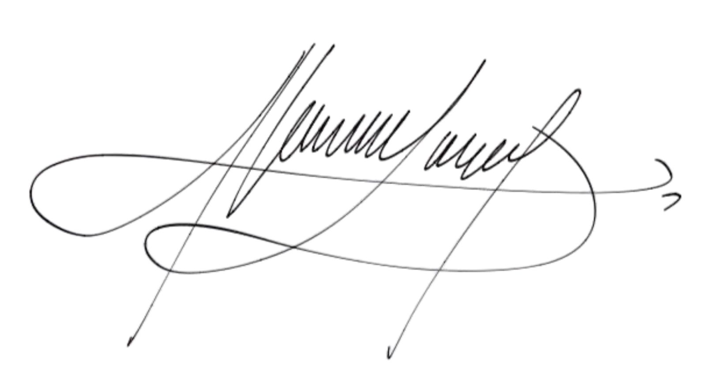

# Deklarasi Penggunaan AI

## Tugas Besar IF2150 - Rekayasa Perangkat Lunak

| Informasi | Keterangan |
|---|---|
| Kelas | *K-03* |
| Nomor Kelompok | *G07* |
| Nama Kelompok | *Siulan* |
| Nama Perangkat Lunak | *LaporKota* |

**Anggota Kelompok:**

| NIM | Nama |
|---|---|
| *13525051* | *Rafi Pradipta Andira Sulistyo* |
| *13525105* | *Pasaribu Fritz T.A.M.* |
| *13525075* | *Bagas Anugrah Putra* |
| *13525099* | *Gede Pranajayanta Suputra* |
| *13525015* | *Muhammad Atallah Ramadhan* |

---

### Daftar Isi
* [Milestone 1](#milestone-1)
* Notes: Copy bagian Daftar Isi seperti Milestone 1 untuk Milestone berikutnya, contoh ``* [Milestone 2](#milestone-2)``. Ketika Daftar isi diklik maka akan langsung diarahkan ke bagian bawah sesuai dengan Milestone tujuan.

---

### Log Penggunaan AI per Milestone

Silakan catat penggunaan AI yang berdampak signifikan pada pengerjaan tugas (misal: *generate* fungsi algoritma yang kompleks, *generate* draf dokumen SKPL/DPPL, atau *debugging* error utama). 
*Penggunaan sepele seperti memperbaiki *typo* atau auto-complete satu baris kode tidak perlu dicatat.*

### Milestone 1
| Tool AI | Tujuan Penggunaan | Contoh Prompt Utama | Modifikasi & Validasi Manusia |
| :--- | :--- | :--- | :--- |
| *Claude* | *Mencari Referensi UU yang Relevan* | *Berikan saya ide UU yang terkait pada pengembangan perangkat lunak ini (disertakan konteks berupa deskripsi singkat perangkat lunak yang kami kembangkan)* | *Beberapa UU yang relevan kami gunakan sebagai bahan pada pengerjaan milestone ini. Sebelum kami masukkan, kami validasi lagi dengan memastikan bahwa UU yang disebutkan valid berdasarkan sumber yang kredibel. Adapun, beberapa saran UU yang diberikan oleh Claude dianggap diluar konteks atau _scope_ pengerjaan proyek perangkat lunak kami.* |
| *Gemini* | *Mengecek relasi antar class* | *"Apakah relasi antara class User dan Order dalam UML ini seharusnya composition atau aggregation?"* | *AI menyarankan composition, tapi setelah dicek kembali ke requirement, kami menggunakan aggregation karena Order masih bisa eksis di history.* |
| | | | | |

### Milestone 2
| Tool AI | Tujuan Penggunaan | Contoh Prompt Utama | Modifikasi & Validasi Manusia |
| :--- | :--- | :--- | :--- |
| | | | | |
| | | | | |

---
### Pernyataan Integritas dan Persetujuan

Kami yang bertanda tangan di bawah ini menyatakan bahwa seluruh log penggunaan AI di atas adalah benar. Kami telah memvalidasi seluruh hasil AI dan bertanggung jawab penuh atas orisinalitas, keamanan, dan kebenaran hasil akhir dari tugas ini.

| Tanda Tangan | Nama Anggota |
| :---: | :--- |
|  | **13525051 - Rafi Pradipta Andira Sulistyo** |
|  | **13525105 - Pasaribu Fritz T.A.M.** |
|  | **13525075 - Bagas Anugrah Putra** |
|  | **13525099 - Gede Pranajayanta Suputra** |
|  | **13525015 - Muhammad Atallah Ramadhan** |