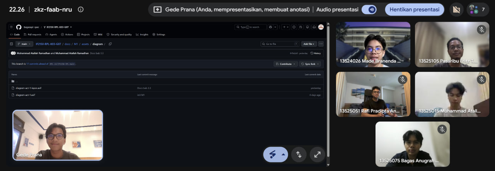

# Form Asistensi

## Tugas Besar IF2150 - Rekayasa Perangkat Lunak

| Informasi | Keterangan |
| --- | --- |
| **Hari** | *Senin* |
| **Tanggal** | *\31/08/2026* |
| **Kelas** | *K-03* |
| **Nomor Kelompok** | *G07*  |
| **Nama Kelompok** | *Siulan*  |
| **Nama Perangkat Lunak** | *\LaporKota*  |
| **Dokumen** | *K03-G07_Template1_TB*  |

### Anggota Kelompok

| NIM | Nama |
| --- | --- |
| *13525051* | *Rafi Pradipta Andira Sulistyo* |
| *13525105* | *Pasaribu Fritz T.A.M.* |
| *13525075* | *Bagas Anugrah Putra* |
| *13525099* | *Gede Pranajayanta Suputra* |
| *13525015* | *Muhammad Atallah Ramadhan* |

### Catatan

| Catatan |
| --- |
| 1. Tambahin source dari berita untuk memperkuat atau artikel |
| 2. Untuk batasan aturan perlu ada tentang Data privacy, apakah terdapat wajah orang di foto tersebut |
| 3. Aktor itu adalah role, satu aktor bisa megang dua peran sekaligus. Eksekutor tidak perlu dimasukan ke aktor karena tidak secara langsung menggunakan platformnya |
| 4. Bedanya aktivitas dan kebutuhan pengguna adalah kebutuhan itu pengguna maunya apa saja, sedangkan aktivitas itu nyampein apa yang akan terjadi di app |

## Dokumentasi

<!--  -->

  

  <i>Gambar 1. Dokumentasi kegiatan asistensi.</i>

